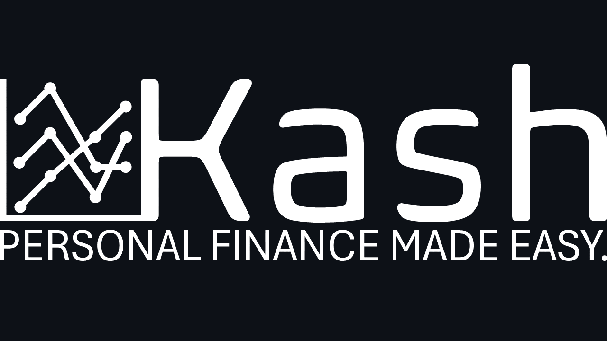

[![Contributors][contributors-shield]][contributors-url]
[![Forks][forks-shield]][forks-url]
[![Issues][issues-shield]][issues-url]
[![MIT License][license-shield]][license-url]
[![LinkedIn][linkedin-shield]][linkedin-url]
[![Website][website-shield]][website-url]
[![Tests][tests-shield]][tests-url]


<!-- PROJECT LOGO -->

<div align="center">
  <a href="https://github.com/irvingmp6/kash">
    
  </a>
  <p align="center">
    An awesome personal finance framework!
    <br />
    <a href="https://irvingmp6.github.io/kash/"><strong>Explore the docs »</strong></a>
    <br />
    <br />
    <a href="https://irvingmp6.github.io/kash/Demo">View Demo</a>
    ·
    <a href="https://github.com/irvingmp6/kash/issues/new?labels=bug&template=bug-report---.md">Report Bug</a>
    ·
    <a href="https://github.com/irvingmp6/kash/issues/new?labels=enhancement&template=feature-request---.md">Request Feature</a>
  </p>
</div>


<!-- TODO: Fix Table of Contents -->
<!-- TABLE OF CONTENTS -->
<details>
  <summary>Table of Contents</summary>
  <ol>
    <li>
      <a href="#about-the-project">About The Project</a>
      <ul>
        <li><a href="#built-with">Built With</a></li>
      </ul>
    </li>
    <li>
      <a href="#getting-started">Getting Started</a>
      <ul>
        <li><a href="#prerequisites">Prerequisites</a></li>
        <li><a href="#installation">Installation</a></li>
      </ul>
    </li>
    <li><a href="#usage">Usage</a></li>
    <li><a href="#license">License</a></li>
    <li><a href="#contact">Contact</a></li>
    <li><a href="#acknowledgments">Acknowledgments</a></li>
  </ol>
</details>
<p></p>

<!-- ABOUT THE PROJECT -->
[![Product Name Screen Shot][product-screenshot]](https://github.com/irvingmp6/kash)
## About The Project
Introducing **Kash**, the ultimate budgeting framework designed to streamline your financial management. With Kash, you get two powerful tools that work together to help you take control of your finances.

### Console App

The console app serves as your financial command center, allowing you to import transactions from all of your bank accounts into a dedicated database. It's designed for speed and simplicity, so you can quickly bring in new data without hassle. Once your transactions are imported, the console app lets you search and display specific records effortlessly, helping you identify key details about your expenses, like what you spent, when, and where. This feature is invaluable for tracking trends, spotting unusual charges, and staying on top of your financial health.

### Dashboard

Kash also includes a comprehensive dashboard, offering a visual approach to managing your expenses. This interactive tool provides a clear overview of your income and expected spending patterns. It lets you define upcoming expenses and set budget limits. The dashboard goes a step further by providing a 90-day cash flow forecast, giving you a predictive edge in managing your money. With this insight, you can make informed decisions about upcoming expenses and ensure you're on track to meet your financial goals.

### Why Kash?

With Kash, you get a complete framework designed to help you manage your budget effectively and plan for the future. Whether you're looking to stay on top of everyday expenses or forecast your cash flow, Kash has the tools you need. It's simple to use, efficient, and offers a clear path to financial control. Start using Kash today and experience the peace of mind that comes with having a well-managed budget.

This repository comes with all you need right out of the box. You just focus on the easy stuff.

<p align="right">(<a href="#readme-top">back to top</a>)</p>

### Built With

The console app was developed using Python 3.12. It uses *Pandas* and *SQLite3* to do the heavy lifting.

* 
* 
* 

The Dashboard is a pre-built workbook template created using sophisticated formulas in Excel.
* 

<p align="right">(<a href="#readme-top">back to top</a>)</p>


<!-- GETTING STARTED -->
## Getting Started

The installation process is fairly simple. There are just a couple prerequisites you want to make sure you have. 

### Prerequisites
* Python 3.12 - Click [HERE](https://www.python.org/downloads/release/python-3123/) to download
* Basic SQL knowledge (to set up your custom queries) - Click [HERE](https://www.w3schools.com/sql/default.asp) to learn SQL

### Installation
Once you have Python 3.12 set up, you have the option of setting up a virtual environment.
#### (Optional) Setting up a Python Virtual Environment
To avoid updating current packages on your global python set up (and possibly messing up the dependencies for other packages), it's always good practice to isolate any new package dependencies with a virtual environment.

**Create** a new Python virtual environment. I'm calling mine `kashEnv`.
```
$ python -v venv kashEnv
```
**Activate** the virtual environment (for Windows users)
```
$ source kashEnv/Scripts/activate 
```
**Activate** the virtual environment (for MacOS or Linux users)
```
$ source kashEnv/bin/activate
```
#### Installing the package
To install the package, follow these steps.

**Download** the repository
```
$ git clone git@github.com:irvingmp6/kash.git
```
**Install** Kash.
```
$ python -m pip install -e ./kash
```

<p align="right">(<a href="#readme-top">back to top</a>)</p>


<!-- USAGE EXAMPLES -->
## Usage
Kash allows you to import your bank activity into a database through the `import` subcommand. 

However, there's a small caveat: Not all bank activity downloaded are created equal. Only CSV files from Chase.com are "import-ready". In other words, only Chase bank activity CSV files are ready to be imported. CSV files from other banks need to be preprocessed so that they are made "import-ready" through the `make-import-ready` subcommand. This will reformat the non-Chase CSV files and make the data ready for import.

### Downloading Bank Activity
Most banks allow you to download your transaction history from their website when you log into your account. 

#### Downloading transaction history from a Chase bank account
1. Login to your [Chase](https://secure.chase.com/web/auth/dashboard#/dashboard/index/index) account.
2. Choose a bank account.
3. Click on the download icon under Transactions. This will take you to a "Download account activity" page.
4. Leave the default settings: 
* **Account**: The account you selected
* **File type**: Spreadsheet (Excel, CSV)
* **Activity**: Current display, including filters
5. Click "Download"

#### Downloading transaction history from a Non-Chase bank account
1. Login to your bank's website.
2. Select an account.
3. Look for a download transactions button and click on it.
4. Definte a date range (if prompted).
5. Download the transactions as a CSV file.

### Importing your bank transactions into a database
The `import` subcommand is used to import "import-ready" CSV files into a database.

`$ kash import /path/to/your_database.db /path/to/bank_activity.csv`

It expects two positional arguments:
1. The path to a database (.db) file.
2. The path to a import-ready CSV file. 

Kash automatically sets up a new SQLite database at the database file location when you run the `import` subcommand for the first time.

### Making a CSV file import-ready
As mentiond before, CSV files downloaded from Chase.com are already "import-ready". However, CSV files from non-chase banks need to be preprocessed using the `make-import-ready` subcommand:

`$ kash make-import-ready /path/to/database.db /path/to/non_chase_bank_activity.csv /path/to/make_import_ready_config.ini`

This command will create a new file with the phrase "_import_ready" append to its filename in the same location. This new file constains the same data as the original file, the only difference being the columns are rearranged so that the file can be properly imported.

Output: `non_chase_bank_activity_import_ready.csv`

This new, reformatted file is now ready for import:

`$ kash import /path/to/your_database.db non_chase_bank_activity_import_ready.csv`

### Pulling Data from the Database
Kash allows users to run pre-defined queries in a config file using the `get` subcommand.

`$ kash run-query /path/to/your_database.db /path/to/predefined_queries.ini query-alias_1`

or

`$ kash run-query /path/to/your_database.db /path/to/predefined_queries.ini query-alias_1 query-alias_2`

or 

`$ kash run-query /path/to/your_database.db /path/to/predefined_queries.ini query-alias_1 query-alias_2 query-alias_3`

The expects two positionsl arguments:
1. The path to a database (.db) file. 
2. The path to a configuration file that contains all the stored queries and their aliases.
3. A space-delimited list of pre-defined query aliases that have been mapped to SQL queries in the configuration file. The 3 examples above illustrates the ability to call a single query, 2 queries, and 3 queries, respectively. However, you can call as many queries as you'd like.

The run-query will only display 1 row per query. To control the number of rows to display, simply use the `--rows` or `-r` option:

`$ kash run-query /path/to/your_database.db /path/to/predefined_queries.ini query-alias_1 --rows 3`

To learn about how to use Kash, please visit the [documnetation](https://irvingmp6.github.io/kash/) where all of these features are explained with more detail. The documentation also includes a [tutorial](https://irvingmp6.github.io/kash/) to help you get started.

<p align="right">(<a href="#readme-top">back to top</a>)</p>

<!-- ROADMAP -->
## Roadmap

- [x] Add ability to consolidate bank activity into a single database
- [x] Add ability to fetch transactions from the console
- [ ] Add Changelog
- [ ] Add to documentation to the Kash Documentation Hub pages:
    - [ ] "Home"
    - [ ] "Getting Started"
    - [ ] "Importing Bank Transactions"
    - [ ] "Querying Bank Transactions"
    - [ ] "Forecasting"
    - [ ] "Tutorial"
- [ ] Add new subcommand `trend` to find spending trends

See the [open issues](https://github.com/irvingmp6/kash/issues) for a full list of proposed features (and known issues).

<p align="right">(<a href="#readme-top">back to top</a>)</p>


<!-- CONTRIBUTING -->
## Contributing

Contributions are what make the open source community such an amazing place to learn, inspire, and create. Any contributions you make are **greatly appreciated**.

If you have a suggestion that would make this better, please fork the repo and create a pull request. You can also simply open an issue with the tag "enhancement".
Don't forget to give the project a star! Thanks again!

1. Fork the Project
2. Create your Feature Branch (`git checkout -b feature/AmazingFeature`)
3. Commit your Changes (`git commit -m 'Add some AmazingFeature'`)
4. Push to the Branch (`git push origin feature/AmazingFeature`)
5. Open a Pull Request

<p align="right">(<a href="#readme-top">back to top</a>)</p>


<!-- LICENSE -->
## License

Distributed under the MIT License. See `LICENSE.txt` for more information.

<p align="right">(<a href="#readme-top">back to top</a>)</p>


<!-- CONTACT -->
## Contact

Irving Martinez - [@irving-mtz](https://linkedin.com/in/irving-mtz) - irvingmp6@hotmail.com

Project Link: [https://github.com/irvingmp6/kash](https://github.com/irvingmp6/kash)

<p align="right">(<a href="#readme-top">back to top</a>)</p>


<!-- MARKDOWN LINKS & IMAGES -->
<!-- https://www.markdownguide.org/basic-syntax/#reference-style-links -->
[contributors-shield]: https://img.shields.io/github/contributors/irvingmp6/kash.svg?style=for-the-badge
[contributors-url]: https://github.com/irvingmp6/kash/graphs/contributors
[forks-shield]: https://img.shields.io/github/forks/irvingmp6/kash.svg?style=for-the-badge
[forks-url]: https://github.com/irvingmp6/kash/network/members
[stars-shield]: https://img.shields.io/github/stars/irvingmp6/kash.svg?style=for-the-badge
[stars-url]: https://github.com/irvingmp6/kash/stargazers
[issues-shield]: https://img.shields.io/github/issues/irvingmp6/kash.svg?style=for-the-badge
[issues-url]: https://github.com/irvingmp6/kash/issues
[license-shield]: https://img.shields.io/github/license/irvingmp6/kash.svg?style=for-the-badge
[license-url]: https://github.com/irvingmp6/kash/blob/master/LICENSE.txt
[linkedin-shield]: https://img.shields.io/badge/-LinkedIn-black.svg?style=for-the-badge&logo=linkedin&colorB=555
[linkedin-url]: https://linkedin.com/in/irving-mtz
[product-screenshot]: docs/images/kash_screenshot.png
[tests-shield]: https://img.shields.io/badge/test_coverage-100%-349914
[tests-url]: https://github.com/irvingmp6/kash/tree/master/tests
[website-shield]: https://img.shields.io/badge/developer-irving--martinez.com-blue
[website-url]: https://irving-martinez.com